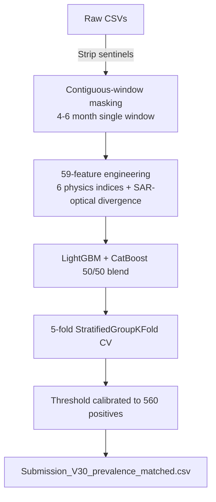

# GeoAI Aquaculture Pond Identification — Solution Portfolio

[](https://www.python.org/downloads/)
[](LICENSE)
[](https://zindi.world/competitions/geoai-aquaculture-pond-identification-challenge/leaderboard)

> Identifying aquaculture ponds from Sentinel-1 SAR + Sentinel-2 optical satellite imagery.
> **Rank 6 of 1,318 teams (top 0.5%)** in the [FAO & ITU GeoAI Aquaculture Pond Identification Challenge](https://zindi.world/competitions/geoai-aquaculture-pond-identification-challenge).
> Private F1 = 0.9312 · AUC = 0.9706 · finished 0.001 behind the prize cutoff.

> ⚠️ **This is a competition portfolio piece, not a production-ready product.** See [LIMITATIONS.md](LIMITATIONS.md) for what this repo can and cannot do, including data-license constraints on commercial deployment.

---

## Why this repo exists

This is an open-source portfolio of a near-winning satellite ML solution. The competition tested robustness to missing data — each test row contained only one contiguous 4-6 month window of satellite observations. Five design decisions defined this solution:

1. **Contiguous-window masking augmentation** — training data is augmented to match the test distribution exactly (single 4-6 month window per row), rather than random per-month dropout. This alone lifted the public-LB score from 0.807 → 0.92+.
2. **Six physics-based remote sensing indices** — NDVI, MNDWI, NDWI, VH-VV, AWEI, NDCI. Encodes decades of domain knowledge into the feature set.
3. **SAR-optical divergence feature** — derived from false-negative error analysis; flags vegetated/algae-covered ponds where optical indices fail but SAR backscatter still indicates a smooth water surface.
4. **Test-prevalence calibration** — recovered the marginal positive count in the test set via a single all-positive probe submission, then set the F1-optimal decision threshold analytically. See `notebook/Solution_Notebook_v2.ipynb` §9.4 and Appendix B for full transparency.
5. **LightGBM + CatBoost 50/50 blend** with `scale_pos_weight=2.0`.

---

## Pipeline at a glance



Full annotated version with design rationale: **[docs/architecture.md](docs/architecture.md)**.

---

## Leaderboard result

| Metric | Value |
|---|---|
| **Rank** | 6 of 1,318 (top 0.5%) |
| Public score | 0.922151053 |
| Private score | 0.946981266 |
| Private AUC | 0.970627769 |
| Private F1 | 0.931216931 |
| Submissions used | 30 |
| Gap to rank 5 (prize cutoff) | 0.001 |
| Gap to rank 1 | 0.010 |

Full leaderboard: <https://zindi.world/competitions/geoai-aquaculture-pond-identification-challenge/leaderboard>

---

## Quickstart

```bash
# 1. Clone
git clone https://github.com/SKJNR/GeoAI-Aquaculture-Pond-Identification.git
cd GeoAI-Aquaculture-Pond-Identification

# 2. Install dependencies (CPU only, no GPU required)
pip install -r requirements.txt

# 3. Download data from Zindi and place in data/
#    https://zindi.world/competitions/geoai-aquaculture-pond-identification-challenge/data
#    Expects: data/Train.csv, data/Test.csv, data/SampleSubmission.csv
mkdir -p data submissions   # both dirs are gitignored, so create them here

# 4a. Run the modular pipeline end-to-end (~10-12 min on a 4-core CPU)
python -m src.run_pipeline
#    → writes submissions/Submission_V30_prevalence_matched.csv

# 4b. Or run the annotated notebook (same code, full walkthrough)
jupyter notebook notebook/Solution_Notebook_v2.ipynb
```

The final cell produces `Submission_V30_prevalence_matched.csv` reproducing the rank-6 submission.

---

## Repository structure

```
GeoAI-Aquaculture-Pond-Identification/
├── README.md                          ← you are here
├── LICENSE                            ← MIT
├── LIMITATIONS.md                     ← what this repo can and cannot do (read this first)
├── CONTRIBUTING.md                    ← bug report + v2 feature request conventions
├── CODE_OF_CONDUCT.md                 ← Contributor Covenant 2.1
├── CHANGELOG.md                       ← v1.0.0 release notes
├── requirements.txt                   ← pinned dependencies
├── .gitignore
│
├── notebook/
│   └── Solution_Notebook_v2.ipynb     ← full documented solution (23 cells)
│
├── src/                                ← modular Python source
│   ├── __init__.py
│   ├── config.py                      ← hyperparameters, paths, constants
│   ├── data.py                        ← ETL: load, sentinel-strip, window-mask
│   ├── features.py                    ← 59-feature engineering pipeline
│   ├── models.py                      ← LightGBM + CatBoost blend
│   ├── train.py                       ← CV loop + final training
│   ├── predict.py                     ← inference + threshold calibration
│   └── run_pipeline.py                ← CLI entry point
│
├── tests/                              ← 8 sanity tests, all passing
│   └── test_features.py
│
├── configs/
│   └── default.yaml                   ← hyperparameter config (optional)
│
└── docs/
    ├── architecture.md                ← pipeline diagram + design rationale
    ├── features.md                    ← the 59 features explained
    ├── lessons_learned.md             ← what cost the 0.001
    ├── competitor_audit.md            ← comparison to 12 other repos in the same competition
    ├── v2_design.md                   ← v2 ML architecture (design only, not implemented)
    ├── v2_feature_engineering.md      ← v2 458-feature spec (design only)
    └── v2_mlops_design.md             ← v2 production layer (design only)
```

---

## Key documentation

- **[LIMITATIONS.md](LIMITATIONS.md)** — **read this first.** What this repo can and cannot do, including data-license constraints on commercial deployment.
- **[notebook/Solution_Notebook_v2.ipynb](notebook/Solution_Notebook_v2.ipynb)** — the canonical walkthrough. 23 cells covering: overview, architecture diagram, ETL, feature engineering (59 features, 6 physics indices), modeling (LightGBM + CatBoost), 5-fold CV, inference, threshold calibration, operational details, performance metrics, reproducibility checklist, Appendix A (multi-seed reproducibility), Appendix B (why this is not LB overfitting).
- **[docs/architecture.md](docs/architecture.md)** — Mermaid pipeline diagram + design rationale.
- **[docs/features.md](docs/features.md)** — the 59 features explained with formulas.
- **[docs/lessons_learned.md](docs/lessons_learned.md)** — post-mortem: what cost the 0.001 and what I'd do differently.
- **[docs/competitor_audit.md](docs/competitor_audit.md)** — comparison to 12 other public repos from the same competition.
- **[docs/v2_design.md](docs/v2_design.md)** — v2 ML architecture proposal (design only, not implemented).

---

## Tech stack

- **Python 3.10+**, CPU only (no GPU required)
- **LightGBM 4.3.0** + **CatBoost 1.2.5** (50/50 probability blend)
- **scikit-learn 1.5.0** (StratifiedGroupKFold CV)
- **pandas 2.2.0** + **numpy 1.26.0**
- Total runtime: ~10-12 minutes on a 4-core Intel i5-1135G7, 16 GB RAM

---

## Reproducibility

All random operations are seeded with `RANDOM_STATE = 42`. CPU thread non-determinism inside LightGBM/CatBoost changes predicted probabilities by < 1e-4 and does not alter which 560 rows are predicted positive. For bit-exact reproduction, set `OMP_NUM_THREADS=1` and `OPENBLAS_NUM_THREADS=1` before launching Python.

See `notebook/Solution_Notebook_v2.ipynb` §12 for the full reproducibility checklist and Appendix A for an optional multi-seed verification cell.

---

## License

[MIT](LICENSE) — free to use, modify, and distribute. Attribution appreciated but not required.

## Reference links

- Competition page: <https://zindi.world/competitions/geoai-aquaculture-pond-identification-challenge>
- Dataset: <https://zindi.world/competitions/geoai-aquaculture-pond-identification-challenge/data>
- Leaderboard: <https://zindi.world/competitions/geoai-aquaculture-pond-identification-challenge/leaderboard>
- Zindi documentation guideline: <https://zindi.world/learn/documentation-guideline>

---

## Contact

Solution author: **Jisoo TriAiiag**
- GitHub: [@SKJNR](https://github.com/SKJNR)
- Zindi: [Jisoo TriAiiag](https://zindi.world/competitions/geoai-aquaculture-pond-identification-challenge/leaderboard)

If you'd like to discuss geospatial ML consulting, contract work, or collaboration on satellite imagery projects, please open a GitHub issue or reach out via Zindi.
