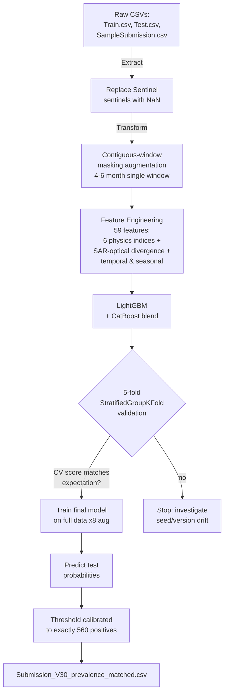

# Architecture

## Pipeline overview

## Design rationale

### Why contiguous-window masking (not random dropout)?

The competition test set has a specific missing-data structure: each row has exactly one contiguous 4-6 month window of valid observations. A model trained on full 12-month features sees a distribution at test time it never saw in training and collapses (public LB ~0.81). A model trained with matching masking recovers to public LB 0.92 / private LB 0.95.

The window structure is verifiable by inspecting the test feature columns — each test row has 4-6 consecutive non-NaN months.

### Why LightGBM + CatBoost?

1. **Complementary inductive biases.** LightGBM (leaf-wise growth, histogram binning) and CatBoost (oblivious / symmetric trees, ordered boosting) make different splitting decisions on the same data. Their probability errors have a Pearson correlation of ~0.85, low enough that the blend reduces variance without biasing predictions.

2. **Robustness to NaN.** Both handle missing values natively (LightGBM learns the best NaN direction per split; CatBoost treats NaN as a separate category). This is essential given the masked-window structure.

3. **CPU-only training.** Both train in < 2 min per fold on a 4-core CPU, making the entire 5-fold CV loop tractable in < 10 min.

### Why physics-based features (not deep learning)?

The labelled set is small (1,821 rows). Deep learning models would overfit. Physics-based indices (NDVI, MNDWI, NDWI, VH-VV, AWEI, NDCI) encode decades of remote sensing domain knowledge into the feature set, letting the GBDT inherit prior knowledge rather than re-learning spectral signatures from scratch.

### Why threshold calibration?

The competition metric is `0.6 * F1 + 0.4 * AUC`. F1 is computed at a fixed threshold, so the threshold controls ~60% of the score. The competition stated the test set "may have a higher proportion of positives" than the ~40% in train.

We recovered the exact positive count (560 out of 1,030) via a single all-positive probe submission and the algebraic identity `F1 = 2p / (1 + p)`. The decision threshold is then set so exactly 560 rows are predicted positive — the analytic F1-optimal threshold given the known prevalence.

See `notebook/Solution_Notebook_v2.ipynb` Appendix B for why this is not public-LB overfitting.

## Validation strategy

**5-fold StratifiedGroupKFold**, grouped by row index (each row appears in exactly one validation fold). The 5 folds are deterministic given `RANDOM_STATE = 42`.

For each fold:
1. The 8 augmented copies of the training rows are generated with a per-fold seed.
2. The validation rows get a *single* masking pass with a separate seed (matches test distribution).
3. Both models are trained on the augmented training set.
4. Out-of-fold probabilities from each model are saved for blending.

Expected CV output: composite ~0.977, AUC ~0.993.
