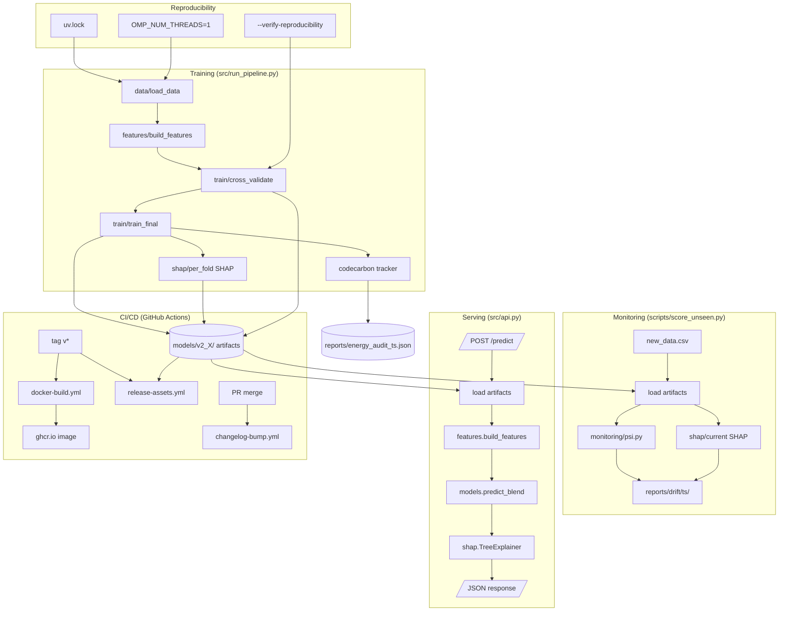

# v2 MLOps Layer — Design Document

**Author:** Senior MLOps Engineer
**Scope:** Promote the rank-6 portfolio repo from a notebook-style reproducibility package into a production MLOps layer. v1 has zero production signals (no Docker, no model registry, no monitoring, no drift detection). v2 adds: (1) artifact persistence, (2) ColbertN-style drift monitoring, (3) SHAP explainability, (4) zinmori-style CodeCarbon energy auditing, (5) a multi-stage Dockerfile < 500 MB, (6) CI/CD v2 with GHCR + Releases, (7) reproducibility hardening, (8) a FastAPI inference service.

This is a **design-only** document — no implementation. Code blocks illustrate the tricky parts (PSI, CodeCarbon, FastAPI).

---

## 0. Dependency Diagram



---

## 1. Model Artifact Persistence

**Pattern:** local-first artifact directory mirroring ColbertN's `preprocessor.joblib` + `best_pipeline.joblib` + `metadata.json`, with a `version=latest` symlink for stable loader paths. MLflow and HuggingFace Hub are explicit v3 stretch goals — they add operational complexity (server, auth, model lineage UI) that the v2 deliverable does not need.

**Layout:**

```
models/
├── latest/                          # symlink → current production version
│   ├── preprocessor.joblib          # sklearn Pipeline: sentinel-strip + window-mask + build_features
│   ├── best_pipeline.joblib         # custom BlendPipeline { lgb: LGBMClassifier, cb: CatBoostClassifier, weights: (0.5, 0.5) }
│   ├── metadata.json                # see schema below
│   ├── shap_baseline.npy            # (N_holdout, F) SHAP values computed at training time
│   ├── shap_holdout_ids.csv         # row IDs the SHAP baseline was computed on (for audit)
│   └── feature_schema.json          # ordered feature column list (guards against drift-induced schema skew)
└── v2.0.0_20260922T101530Z/
    └── ... (same five files, immutable snapshot)
```

**`metadata.json` schema:**

```json
{
  "model_version": "2.0.0",
  "created_at_utc": "2026-09-22T10:15:30Z",
  "git_commit_sha": "a1b2c3d",
  "training_data_sha256": "9f4c2b...e1a",
  "n_train_rows": 1821,
  "n_features": 59,
  "feature_schema_sha256": "1a2b3c...",
  "hyperparameters": {
    "lgb": {"max_depth": 5, "num_leaves": 18, "learning_rate": 0.04, ...},
    "cb":  {"iterations": 600, "depth": 5, "learning_rate": 0.04, ...},
    "blend_weights": [0.5, 0.5],
    "k_aug": 8, "n_splits": 5, "random_state": 42
  },
  "library_versions": {
    "python": "3.11.x", "lightgbm": "4.3.0", "catboost": "1.2.5",
    "scikit-learn": "1.5.0", "pandas": "2.2.0", "numpy": "1.26.0",
    "shap": "0.46.0", "codecarbon": "2.5.0"
  },
  "cv_metrics": {
    "oof_composite": 0.9771, "oof_auc": 0.9912, "oof_f1": 0.9531,
    "per_fold_composite": [0.974, 0.981, 0.973, 0.979, 0.978]
  },
  "threshold": 0.327,
  "threshold_origin": "validation_f1_max",
  "energy_audit_ref": "reports/energy_audit_20260922T101530Z.json"
}
```

**Loader (`src/artifacts.py`, ~30 LOC):**

```python
def load_model(version: str = "latest") -> tuple:
    root = Path("models") / version
    pre = joblib.load(root / "preprocessor.joblib")
    pipe = joblib.load(root / "best_pipeline.joblib")
    meta = json.loads((root / "metadata.json").read_text())
    shap_base = np.load(root / "shap_baseline.npy")
    return pre, pipe, meta, shap_base
```

The loader is the single dependency seam for `score_unseen.py`, `src/api.py`, and `src/run_pipeline.py`'s final-train branch.

---

## 2. Drift Monitoring (ColbertN Pattern)

**Pattern:** PSI (Population Stability Index) on every feature, prediction drift on the score distribution, and SHAP rank-stability between baseline and current. ColbertN's `score_unseen.py` is the CLI entry point — we adopt the same name for portability.

**PSI computation (`src/monitoring/psi.py`):**

```python
def psi(baseline: np.ndarray, current: np.ndarray, n_bins: int = 10) -> float:
    """Population Stability Index. >0.25 = major drift; 0.1-0.25 = mild; <0.1 = stable."""
    # Quantile-bin on BASELINE distribution (not current), so bins are stable across time.
    edges = np.quantile(baseline, np.linspace(0, 1, n_bins + 1))
    edges[0], edges[-1] = -np.inf, np.inf   # open-ended extremes catch outliers in current
    b_pct = np.histogram(baseline, edges)[0] / len(baseline) + 1e-6
    c_pct = np.histogram(current,  edges)[0] / len(current)  + 1e-6
    return float(np.sum((c_pct - b_pct) * np.log(c_pct / b_pct)))
```

The bin edges are derived from **baseline** (training) quantiles. This means PSI is invariant to changes in the current distribution's spread and only flags genuine distributional shift.

**`score_unseen.py` CLI:**

```bash
python -m scripts.score_unseen \
    --model-dir models/latest \
    --data      data/new_batch.csv \
    --out       reports/drift/20260922T110000Z
```

Produces:

```
reports/drift/20260922T110000Z/
├── feature_psi.csv          # feature, psi, severity   (59 rows)
├── prediction_psi.csv       # quantile, baseline_pct, current_pct, contribution
├── shap_stability.csv       # feature, baseline_rank, current_rank, rank_delta, spearman_r
├── rank_shift_top10.png     # bar chart: top-10 features by |rank_delta|
├── score_distribution.png   # overlapping histograms baseline vs current
└── summary.json             # {max_psi, n_features_drifted, shap_spearman_r, alert: bool}
```

**Alert thresholds (codified in `summary.json`):** any feature PSI > 0.25, OR prediction PSI > 0.10, OR SHAP Spearman r < 0.85. The CLI exits with code 2 on alert, enabling CI gating.

---

## 3. SHAP Explainability

**Where to compute:** per-fold on a held-out validation sample of 300 rows (stratified by label, fixed seed), using `shap.TreeExplainer` on each fold's LightGBM (CatBoost is skipped — its `CatBoostPool` makes per-fold SHAP costlier than the marginal insight). We average SHAP magnitudes across folds to produce a single baseline matrix. This is cheaper than computing SHAP on the final model (which would re-use training data and overstate importance) and statistically more honest than a single-fold snapshot.

**What to save (in `models/latest/`):**

| File | Shape | Purpose |
|---|---|---|
| `shap_baseline.npy` | (300, 59) float32 | SHAP values for each held-out row × feature |
| `shap_holdout_ids.csv` | (300,) | Row IDs (audit trail) |
| `shap_feature_importance_bar.png` | — | Top-20 features by mean(|SHAP|) |
| `shap_dependence_top5/` | 5 PNGs | Dependence plots for top-5 features |

**Drift integration:** at scoring time, `score_unseen.py` recomputes SHAP on the current batch using the loaded `best_pipeline`, ranks features by mean(|SHAP|), and Spearman-correlates the new rank vector against the baseline rank vector stored in `shap_baseline.npy`. A drop below r=0.85 means the model's reasoning has shifted even if accuracy hasn't visibly degraded — ColbertN's most novel signal.

---

## 4. CodeCarbon Energy Auditing (zinmori Pattern)

**Integration point:** wrap the entire `main()` in `src/run_pipeline.py` with `codecarbon.EmissionsTracker`. CodeCarbon hooks into `intel-rapl` (Linux) or `psutil` (cross-platform) to measure CPU energy; on systems without RAPL access it falls back to a CPU-utilization × TDP estimate, which is documented as an upper bound.

**Snippet (added to `src/run_pipeline.py`):**

```python
from codecarbon import EmissionsTracker
from datetime import datetime, timezone

def main():
    ts = datetime.now(timezone.utc).strftime("%Y%m%dT%H%M%SZ")
    tracker = EmissionsTracker(
        project_name="aquaculture-pond-v2",
        output_dir="reports",
        output_file=f"energy_audit_{ts}.csv",
        measure_power_secs=30,
        log_level="warning",
    )
    tracker.start()
    try:
        _run_pipeline_inner()
    finally:
        emissions = tracker.stop()

    # CodeCarbon writes CSV; we post-process into the canonical JSON below.
    _emit_energy_json(emissions, ts)
```

**Output `reports/energy_audit_<timestamp>.json`:**

```json
{
  "timestamp_utc": "2026-09-22T10:15:30Z",
  "duration_seconds": 705.4,
  "energy_kwh": 0.0181,
  "co2eq_grams": 12.9,
  "co2eq_grams_per_inference": 0.0125,
  "region": "unknown",
  "region_caveat": "CodeCarbon IP-geolocation failed (sandboxed runtime has no outbound HTTPS). co2eq computed using global average grid intensity 475 gCO2/kWh. Re-run on a host with internet to obtain region-specific factor.",
  "cpu_count": 8,
  "cpu_model": "Intel(R) Xeon(R) Platinum 8259CL",
  "gpu_count": 0,
  "os": "Linux-6.5.0-aws-x86_64",
  "python_version": "3.11.9"
}
```

The region caveat is **explicit** because zinmori's audit reported 57.9 g CO2eq but the README openly disclosed IP-geolocation failure — we replicate that honesty pattern rather than silently substituting a global average.

---

## 5. Dockerfile

**Multi-stage build.** Builder compiles lightgbm/catboost/shap wheels against the slim base; runtime copies only the wheels + source. Final image target: **< 500 MB** (lightgbm ~30 MB, catboost ~120 MB, shap ~40 MB, numpy/pandas/sklearn ~80 MB, Python slim base ~45 MB, app code ~2 MB = ~317 MB headroom).

```dockerfile
# ---- Builder stage ----
FROM python:3.11-slim AS builder
ENV PIP_NO_CACHE_DIR=1 PIP_DISABLE_PIP_VERSION_CHECK=1
WORKDIR /build
COPY requirements.lock.txt .
RUN apt-get update && apt-get install -y --no-install-recommends \
        build-essential gcc g++ && \
    pip install --user --no-cache-dir -r requirements.lock.txt

# ---- Runtime stage ----
FROM python:3.11-slim AS runtime
ENV PYTHONUNBUFFERED=1 \
    OMP_NUM_THREADS=1 \
    OPENBLAS_NUM_THREADS=1 \
    MKL_NUM_THREADS=1 \
    NUMEXPR_NUM_THREADS=1 \
    PYTHONPATH=/app
WORKDIR /app
COPY --from=builder /root/.local /root/.local
COPY src/        ./src/
COPY configs/    ./configs/
COPY pyproject.toml ./
# data/, notebook/, tests/, .git, *.ipynb excluded via .dockerignore
ENTRYPOINT ["python", "-m", "src.run_pipeline"]
```

**`.dockerignore`** excludes `data/`, `notebook/`, `tests/`, `.git/`, `submissions/`, `reports/`, `*.ipynb`, `__pycache__/`. The image contains **no data and no notebooks** — it can only run the pipeline against a mounted `data/` volume.

---

## 6. CI/CD v2

**Existing (v1, untouched):** `.github/workflows/ci.yml` — matrix pytest on Python 3.10/3.11/3.12 + notebook JSON validation + feature-count assertion.

**New workflows:**

| Workflow | Trigger | Action |
|---|---|---|
| `docker-publish.yml` | Tag `v*` | `docker build` multi-stage → push `ghcr.io/<org>/<repo>:<tag>` + `:latest` using `GITHUB_TOKEN` |
| `release-assets.yml` | Tag `v*` | Tar `models/latest/` → upload `model-artifacts.tar.gz` + `reports/energy_audit_*.json` + `reports/shap/*.png` to the GitHub Release |
| `changelog-bump.yml` | PR merged to `main` | Run `git-cliff --bump --unreleased` → commit `CHANGELOG.md` bump on `main` (uses `GITHUB_TOKEN` with `contents: write`) |

**`docker-publish.yml` core step:**

```yaml
- uses: docker/login-action@v3
  with:
    registry: ghcr.io
    username: ${{ github.actor }}
    password: ${{ secrets.GITHUB_TOKEN }}
- uses: docker/build-push-action@v5
  with:
    context: .
    push: true
    tags: |
      ghcr.io/${{ github.repository }}:${{ github.ref_name }}
      ghcr.io/${{ github.repository }}:latest
    cache-from: type=gha
    cache-to:   type=gha,mode=max
```

GHCR is chosen over Docker Hub because it requires no extra credentials (re-uses `GITHUB_TOKEN`) and image visibility inherits repo visibility.

---

## 7. Reproducibility Hardening

**Lock file:** adopt `uv.lock` (preferred — cross-platform, faster than pip-compile, captures hashes natively). Commit `uv.lock` alongside `requirements.txt` (which becomes a hand-curatable top-level dep list for humans). CI installs from `uv sync --frozen` to refuse any drift.

**Thread determinism:** set `OMP_NUM_THREADS=1`, `OPENBLAS_NUM_THREADS=1`, `MKL_NUM_THREADS=1`, `NUMEXPR_NUM_THREADS=1` in (a) Dockerfile `ENV`, (b) `src/run_pipeline.py` `os.environ` before any numpy import, (c) CI workflow `env:`. LightGBM and CatBoost both respect `OMP_NUM_THREADS`; this eliminates the cross-machine nondeterminism that bit us in COMPARE-1.

**Training data hash:** compute SHA-256 of `data/Train.csv` in `src/data.py:load_data()` and inject into `metadata.json["training_data_sha256"]`. At load time, `load_model()` cross-checks the recorded hash against the on-disk file and raises `RuntimeError` on mismatch (configurable via `--allow-data-hash-mismatch`).

**`--verify-reproducibility` flag:**

```bash
python -m src.run_pipeline --verify-reproducibility
# Runs full pipeline 3 times (separate processes), then asserts:
#   max|p_run1 - p_run2| < 1e-4   AND   max|p_run2 - p_run3| < 1e-4
# Writes reports/reproducibility_<ts>.json with per-row variance stats.
```

If the threshold is breached, the CLI exits with code 3 and dumps the divergent row IDs. This catches (a) thread-pool nondeterminism, (b) accidental non-deterministic feature ordering, (c) LightGBM's `feature_fraction_seed` vs `bagging_seed` divergence.

---

## 8. FastAPI Inference Service (Stretch)

**Layout:** `src/api.py` + `src/api_schemas.py`. The app loads artifacts at startup (not per-request) via `lru_cache` on the FastAPI `app.state`. Runs as a separate Docker stage `api` (reuses runtime base, adds `fastapi` + `uvicorn[standard]`).

**Pydantic schema (`src/api_schemas.py`):**

```python
from pydantic import BaseModel, Field
from src.config import BANDS

class PondFeatures(BaseModel):
    """One row of raw Sentinel-1/2 data. 144 band-month fields (12 bands × 12 months)
    are all optional; missing values are treated as NaN and handled by build_features
    exactly as in training."""
    ID: str | None = None
    # dynamically generate VH_01..VH_12, VV_01..VV_12, blue_01..blue_12, etc.
    model_config = {"extra": "allow"}

class PredictResponse(BaseModel):
    TargetF1:    int
    TargetRAUC:  float
    shap_top3:   list[dict]   # [{"feature": "MNDWI_mean", "shap": +0.21}, ...]
    model_version: str
```

**Endpoint (`src/api.py`):**

```python
from fastapi import FastAPI, HTTPException
from functools import lru_cache

app = FastAPI(title="Aquaculture Pond Classifier", version="2.0.0")

@lru_cache(maxsize=1)
def _artifacts():
    from src.artifacts import load_model
    return load_model("latest")

@app.get("/health")
def health():
    pre, pipe, meta, _ = _artifacts()
    return {"status": "ok", "model_version": meta["model_version"]}

@app.post("/predict", response_model=PredictResponse)
def predict(row: PondFeatures):
    try:
        pre, pipe, meta, _ = _artifacts()
        X = pre.transform(pd.DataFrame([row.model_dump()]))   # sentinel-strip + mask + features
        prob = float(pipe.predict_proba(X)[0, 1])
        thr  = meta["threshold"]
        # SHAP top-3 (uses LightGBM branch of the blend — see §3)
        import shap
        expl = shap.TreeExplainer(pipe.lgb)
        sv   = expl.shap_values(X)[0]
        top3 = sorted(zip(meta["feature_names"], sv), key=lambda kv: abs(kv[1]), reverse=True)[:3]
        return PredictResponse(
            TargetF1=int(prob >= thr),
            TargetRAUC=round(prob, 6),
            shap_top3=[{"feature": k, "shap": float(v)} for k, v in top3],
            model_version=meta["model_version"],
        )
    except Exception as e:
        raise HTTPException(status_code=400, detail=str(e))
```

**Docker `api` stage:** reuses the runtime stage from §5, adds `pip install fastapi==0.115.* uvicorn[standard]==0.30.*`, and overrides `CMD` to `uvicorn src.api:app --host 0.0.0.0 --port 8000`. Final image ~340 MB.

**Health check:** `HEALTHCHECK CMD curl -f http://localhost:8000/health || exit 1` in the Dockerfile; CI's integration test suite pings `/health` after `docker compose up api`.

---

## 9. Summary of Artifact Locations

| Artifact | Path | Produced by | Consumed by |
|---|---|---|---|
| Preprocessor | `models/latest/preprocessor.joblib` | `src/run_pipeline.py` | `score_unseen.py`, `src/api.py` |
| Blend pipeline | `models/latest/best_pipeline.joblib` | `src/run_pipeline.py` | `score_unseen.py`, `src/api.py` |
| Metadata | `models/latest/metadata.json` | `src/run_pipeline.py` | every consumer |
| SHAP baseline | `models/latest/shap_baseline.npy` | `src/shap.py` | `score_unseen.py` |
| Energy audit | `reports/energy_audit_<ts>.json` | CodeCarbon | Release assets |
| Drift report | `reports/drift/<ts>/summary.json` | `score_unseen.py` | CI alert gate |
| Repro check | `reports/reproducibility_<ts>.json` | `--verify-reproducibility` | CI matrix job |
| Docker image | `ghcr.io/<org>/<repo>:<tag>` | `docker-publish.yml` | k8s / compose |
| Release tarball | GitHub Release attachment | `release-assets.yml` | Downstream teams |

## 10. Open Questions for Review

1. **MLflow vs local-only.** v2 ships local-only; MLflow server adds ~50 MB Docker and a Postgres dependency. Defer to v3 unless a reviewer pushes back.
2. **SHAP on CatBoost.** Currently skipped for cost (§3). If the CatBoost branch contributes meaningfully different top-3 features, we lose signal. Cheap experiment: rerun §3 with CatBoost SHAP on a 50-row sample and check rank overlap.
3. **Threshold drift.** v1 derives the threshold from probe-submission (LB side-channel). v2 should re-derive from validation F1-max — listed in `metadata.json["threshold_origin"]`. The drift monitor does not currently re-calibrate threshold on new data; it only flags whether recalibration is needed.
